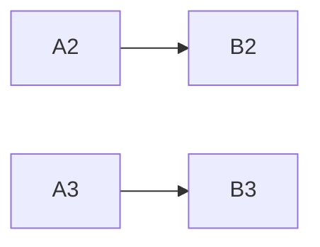

# office.md

office.md is a local-first Markdown and CSV editor built with Milkdown. It treats an opened folder as a small document project: Markdown files can include other Markdown or CSV files, Mermaid diagrams can read cells and ranges from CSV, document CSS is scoped to the rendered page, and explicit Store/Reload actions synchronize with the real filesystem. The same renderer and application runtime can run as a web app or an Electron desktop app.

## Features

- Rich Markdown editing with headings, lists, links, tables, code, LaTeX, and Mermaid.
- Continuous, paged-document, and presentation layouts with configurable page sizes and forced page breaks.
- A CSV spreadsheet editor with formulas, row/column actions, sorting, and evaluated CSV export.
- Live Markdown and CSV includes.
- CSV-backed Mermaid diagrams, including `xychart-beta` row and column ranges.
- Document-only CSS themes, including document, code, heading, and Mermaid fonts.
- Create new Markdown documents and CSV spreadsheets from the Files panel.
- Create folders and delete supported files or empty folders from disk-backed projects.
- Disk-backed folder projects when running locally, with explicit Store, Reload, Rename, New File, and New Folder actions.
- Portable Markdown, evaluated CSV, standalone HTML, and print-to-PDF export.

## Run locally

Requirements: Node.js 22.22.2 or newer and npm.

```bash
npm install
npm run dev
```

Open the URL printed by Vite, normally `http://localhost:5173`.

When the app runs through Vite, **Open folder** uses the local filesystem bridge. It accepts Linux paths, Windows drive paths, and WSL paths such as:

```text
/home/me/project
C:\Users\me\project
\\wsl$\Ubuntu\home\me\project
```

The bridge reads and writes `.md`, `.markdown`, `.css`, and `.csv` files below the selected folder. Hidden files and directories, binary files, `.git`, `node_modules`, and `dist` are ignored. When the app is hosted without the local Vite bridge, it falls back to the browser File System Access API where supported.

In a disk-backed project, edits are autosaved while you work; **Store** forces an immediate write. **Reload** discards cached project data and reads the folder again from disk.

Use **New Folder** to create a visible folder inside the open workspace. The trash actions in the Files panel delete supported files and empty folders; folders containing files must be emptied first.

### Run the desktop target

The Electron target loads the same Vite renderer and supplies disk access through a narrow, validated preload bridge. The renderer runs with context isolation and without Node integration.

```bash
# Development/build check for the web renderer plus Electron main/preload files
npm run build:electron

# Build and launch the desktop app
npm run electron:start
```

The desktop app opens local folders through the native folder dialog. Workspace files remain the source of truth; no desktop-only document database is introduced. VS Code integration is intentionally deferred.

### Desktop releases

GitHub Actions creates desktop releases for stable tags in the form `vMAJOR.MINOR.PATCH`, for example `v0.1.0`. After the workflow completes, download the platform package from the repository's GitHub **Releases** page:

- `office.md-<version>-linux-x64.AppImage`
- `office.md-<version>-windows-x64.exe`

Local packaging is native to the host and never publishes a GitHub release:

```bash
# Linux x64 AppImage
npm run package:electron -- --linux --x64

# Windows x64 NSIS installer (run on Windows)
npm run package:electron -- --win --x64
```

Packages are written to `release/`. The first release packages are unsigned, so Windows SmartScreen and Linux desktop policies may show security warnings before launch.

## Project syntax

Include another Markdown or CSV file as a live block:

```markdown
![[notes.md]]
```

Link a Mermaid diagram to a CSV file:

````markdown

````

Individual references retain their Mermaid IDs and receive the CSV value as a label. CSV ranges work inside Mermaid's native `xychart-beta` syntax:

````markdown
```mermaid(tables/plot.csv)
xychart-beta
  title "Visitors"
  x-axis [A2:A7]
  y-axis "Count" 0 --> 250
  %% Visitors
  line [B2:B7]
  %% Signups
  bar [C2:C7]
```
````

For numeric series, only the first value receives the series label. CSV formulas remain formulas in the editable and stored CSV; previews and exports use evaluated values.

## Page breaks and export

In document or presentation mode, a thematic break creates a forced page break:

```markdown
First page

---

Second page
```

Export options are:

- **Portable Markdown**: recursively inserts includes and materializes CSV-backed Mermaid values.
- **HTML**: creates a standalone paged document using the active document style.
- **PDF**: opens the browser print flow; choose “Save as PDF.”
- **CSV**: downloads evaluated formula results.

## Document CSS

Open a `.css` file from the Files panel to apply it. Selectors are scoped to `.editor-wrap`, so document styles do not change the application chrome. Theme files can define these variables:

```css
:root {
  --page-bg: #f4f1e8;
  --paper: #fffdf8;
  --ink: #2d2a24;
  --heading-ink: #514838;
  --line: #d8d0c0;
  --document-font: Georgia, serif;
  --heading-font: "Trebuchet MS", sans-serif;
  --code-font: "Cascadia Mono", monospace;
  --code-background: #f6f5f0;
  --code-border: #dfddd4;
  --code-text: #24231f;
  --code-comment: #77766f;
  --code-punctuation: #55534d;
  --code-literal: #a83a64;
  --code-string: #2f7a4b;
  --code-operator: #9a5c13;
  --code-keyword: #5b50c7;
  --code-function: #247493;
  --code-variable: #9a5c13;
  --diagram-font: var(--heading-font);
}
```

Only Markdown and CSV files can be included. CSS files are applied directly from the Files panel.

## Tests

The test suite checks behavior and external side effects, not only rendered controls.

```bash
# Unit and DOM integration tests
npm test

# Browser and Electron tests with real temporary folders and downloads
npm run test:e2e

# Everything
npm run test:all

# OpenSpec structure and active changes
npm run spec:validate
```

The browser suite automatically uses `/snap/bin/chromium` when available. Else install Playwright Chromium:

```bash
npx playwright install chromium
```

To use another installed browser binary:

```bash
PLAYWRIGHT_CHROMIUM_PATH=/path/to/chromium npm run test:e2e
```

Coverage includes CSV parsing and serialization, Mermaid range expansion, portable export materialization, safe File System Access renames, local bridge writes and renames, Store/Reload behavior, CSV formula evaluation, spreadsheet and Markdown table actions, includes, scoped CSS, document layouts, downloads, source editing, and responsive toolbars.

## Build

```bash
# Web production build
npm run build

# Web renderer plus Electron main/preload build
npm run build:electron

# Serve the web production build
npm run preview
```

The web production output is written to `dist/`; Electron entry points are written to the ignored `dist-electron/` directory. A static deployment can edit browser-local projects, while unrestricted path-based disk access remains intentionally available only through the local Vite server or the Electron main process.

## Development workflow

Product behavior is specified in [`openspec/specs/`](openspec/specs/), and each feature or bug fix is planned in an active change under [`openspec/changes/`](openspec/changes/). The repository uses OpenSpec with TDD:

1. Start with `$grill-with-docs` when the design or terminology is still fuzzy; record clarified terms in `CONTEXT.md` and durable trade-offs as ADRs.
2. Use `$openspec-explore` for investigation, then `$openspec-propose` to create a reviewable proposal, specs, design, and task list.
3. Review and correct the artifacts before implementation. Apply them with `$openspec-apply-change` using a red-green-refactor loop.
4. Run `$openspec-verify-change`, sync the completed spec deltas, and archive with `$openspec-archive-change`.

The full contributor routine and runtime layering are documented in [`docs/development-workflow.md`](docs/development-workflow.md). OpenSpec `1.11.0` is pinned for repository validation; the matching CLI is also required globally for the Codex workflow skills.

## Source map

- `src/main.ts` — shared renderer/editor integration and UI orchestration.
- `src/workspace-application.ts` and `src/editor-runtime.ts` — host-neutral workspace actions and runtime composition.
- `src/workspace-port.ts` — public workspace capability contract and deterministic test fake.
- `src/web-workspace-port.ts` — local Vite bridge and browser File System Access adapters.
- `src/electron-workspace-port.ts` — renderer-side adapter for the secure Electron bridge.
- `electron/main.ts`, `electron/preload.ts`, and `electron/workspace-service.ts` — desktop shell, allowlisted IPC bridge, and validated filesystem service.
- `src/plugins/` — Milkdown views for Mermaid, includes, LaTeX, rich content, and page layout.
- `src/csv-utils.ts` — CSV parser, serializer, Markdown conversion, and Mermaid expansion.
- `src/local-file-system.ts` — browser File System Access implementation.
- `vite.config.ts` — guarded local filesystem bridge.
- `src/document-export.ts` and `src/portable-markdown.ts` — export pipelines.
- `examples/` — feature tour, CSV examples, and document themes.
