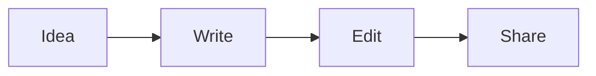

# A small Markdown studio

This is the live feature tour. Everything in this document is editable. Use
the toolbar, the outline, the file actions, and the theme picker to explore the
editor without leaving this page.

## Rich text

Try **bold**, *italic*, ~~strikethrough~~, `inline code`, and this [Milkdown
link](https://milkdown.dev). Select text to open the floating toolbar, or use
the persistent toolbar above the document.

> The editor keeps the Markdown underneath the rendered document. Use “Copy
> markdown” to take the source with you.

## Lists and tables

- [x] Rich text marks and links
- [x] Undo and redo
- [ ] Add your own next step

1. Choose a block.
2. Format it with the toolbar.
3. Keep writing.

| Feature | Markdown | Renderer |
| --- | --- | --- |
| Code | Fenced block | Prism |
| Formula | Dollar delimiters | KaTeX |
| Diagram | Mermaid block | Mermaid |

## Code

```python
def greet(name: str) -> str:
    return f"Hello, {name}!"

print(greet("Milkdown"))
```

## LaTeX

Inline math stays in the sentence: $E = mc^2$.

$$
\int_{0}^{\infty} e^{-x^2} \, dx = \frac{\sqrt{\pi}}{2}
$$

Click a formula to edit only its expression.

## Mermaid

Click the diagram preview to edit its source. The editor intentionally shows
only the Mermaid source; the surrounding Markdown code fence is preserved by
the document, not copied into the diagram.



## Linked Markdown

The Include buttons in the Files panel insert live links. Try including
`notes.md` or `snippets.md`, then edit that file and switch back here.

![[notes.md]]

## Try the workspace

- Click a heading in the Outline to jump through this document.
- Create and rename browser-local files with the Files panel.
- Open `examples/local-folder-demo` with **Open folder** to edit real files.
- Open `examples/css-folder-demo` with **CSS folder** to load custom themes.

